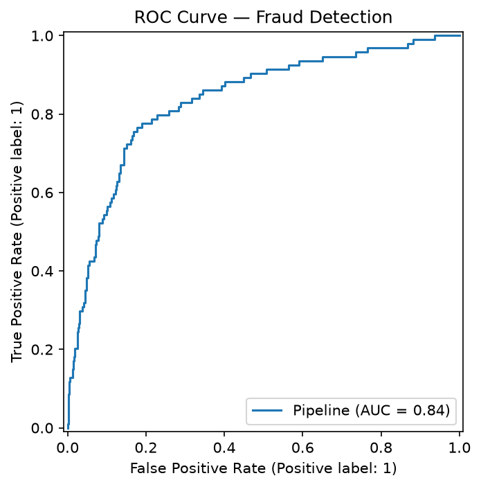
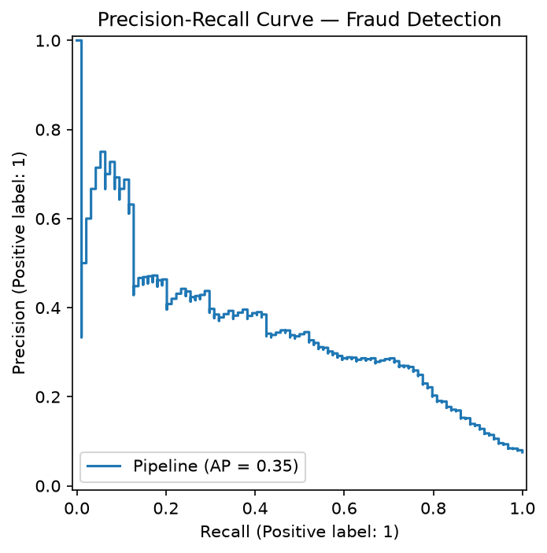
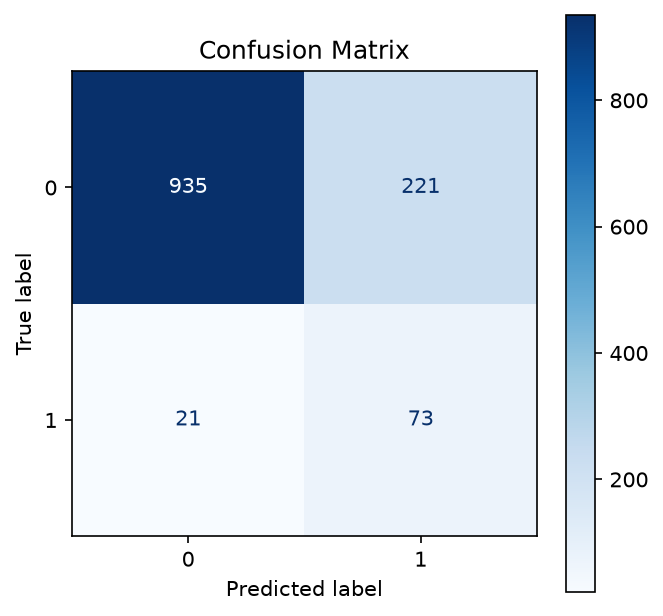

# 🔍 AI-Based Fraud Detection System for Insurance Claims

A multimodal machine learning system that scores insurance claims for fraud risk
by fusing **structured claim data**, **claim narrative text (NLP)**, and
**claim photo evidence (computer vision)** into a single model, served through
a REST API and an interactive demo.

> **Dataset:** Fully synthetic, generated by `src/generate_data.py` with a
> noisy, non-deterministic fraud-generating process (see *Design notes* below)
> — no real customer or policyholder data is used anywhere in this project.

## Results

| Model | 5-fold CV ROC-AUC | Test ROC-AUC | Test PR-AUC |
|---|---|---|---|
| Logistic Regression | 0.851 ± 0.014 | **0.837** | 0.354 |
| Random Forest | 0.793 ± 0.018 | — | — |

Logistic Regression was selected automatically (best CV ROC-AUC). At the
default 0.5 threshold on the held-out test set: **78% recall on fraud**
(catches most fraud cases) at 25% precision — a deliberate choice, since in
fraud detection missing a fraud case is usually costlier than a false alarm
that goes to manual review. The threshold is tunable at inference time
(see the API section).

<p align="center">
  
  
  
</p>

## Why this project

Real insurance claims arrive with more than one type of evidence: a form, a
written description, and photos. This project explores whether fusing all
three modalities beats any single source alone, and packages the result as a
deployable service rather than a one-off notebook.

## Architecture

```
Raw claim (JSON/CSV) ──┬── Numeric fields ──── StandardScaler ──────┐
                        ├── Location ────────── OneHotEncoder ──────┤
                        ├── Narrative text ───── TF-IDF (1-2 grams) ─┼──▶ Fused feature vector ──▶ Classifier ──▶ fraud_probability
                        └── Claim image ──────── Custom CV extractor─┘         (LogReg / RF / XGBoost, CV-selected)
```
All of this is a single `sklearn.pipeline.Pipeline` (`ColumnTransformer` +
classifier), saved as one `.pkl` artifact — no separate preprocessing code
to keep in sync at serving time.

## Project structure

```
fraud-detection-system/
├── data/                        # generated data (gitignored, regenerate locally)
├── src/
│   ├── generate_data.py         # synthetic multimodal data generator
│   ├── features.py              # ColumnTransformer: numeric/cat/text/image fusion
│   ├── train.py                 # trains & CV-compares models, saves best pipeline
│   ├── evaluate.py              # ROC/PR/confusion-matrix/SHAP plots
│   └── api.py                   # FastAPI inference service
├── app_streamlit.py             # interactive demo UI
├── tests/
│   └── test_features.py         # unit tests for the feature pipeline
├── models/                      # saved pipeline + metrics.json (gitignored)
├── reports/figures/             # generated evaluation plots
├── .github/workflows/ci.yml     # lint + test + smoke-train on every push
├── Dockerfile
├── requirements.txt
└── README.md
```

## Setup

```bash
git clone https://github.com/<your-username>/fraud-detection-system.git
cd fraud-detection-system
python -m venv venv
source venv/bin/activate        # venv\Scripts\activate on Windows
pip install -r requirements.txt
```

## Usage

```bash
# 1. Generate the synthetic multimodal dataset (structured + text + images)
python src/generate_data.py --n 5000 --seed 42 --out data

# 2. Train & compare models, save the best pipeline
python -m src.train --data data/insurance_claims.csv --model-dir models

# 3. Generate evaluation plots (ROC, PR curve, confusion matrix, SHAP)
python -m src.evaluate --data data/insurance_claims.csv --model models/fraud_pipeline.pkl

# 4. Run tests
pytest tests/ -v

# 5. Serve the model as an API
uvicorn src.api:app --reload --port 8000
# then: POST http://localhost:8000/predict  (see src/api.py for the payload shape)

# 6. Or launch the interactive demo
streamlit run app_streamlit.py
```

### Run with Docker

```bash
docker build -t fraud-api .
docker run -p 8000:8000 fraud-api
```

## Design notes (things I'd flag proactively in an interview)

- **Class imbalance:** fraud is ~7.5% of claims (realistic base rate),
  handled via `class_weight="balanced"` rather than oversampling, and
  evaluated with PR-AUC alongside ROC-AUC since ROC-AUC alone is
  overly optimistic on imbalanced data.
- **No data leakage:** an earlier version of this dataset had claim
  narratives drawn from only ~30 repeated templates that perfectly
  predicted the label, producing a (meaningless) 1.00 AUC. The generator
  was rewritten so text is per-row unique and only loosely correlated
  with fraud, and the resulting ~0.84 AUC is the honest number.
- **Image features:** currently classical CV descriptors (intensity,
  edge density, color histogram) rather than deep embeddings, chosen so
  the project runs on CPU with no GPU dependency. `src/features.py` is
  structured so swapping in a frozen CNN (ResNet/EfficientNet via
  `torchvision`) is a localized change, not a rewrite.
- **Single serialized pipeline:** preprocessing and the classifier are
  one `sklearn.Pipeline`, so there's no train/serve skew from
  reimplementing feature logic in the API layer.

## Roadmap

- [ ] Swap classical image features for a frozen CNN embedding backbone
- [ ] Threshold tuning UI / cost-sensitive threshold selection (fraud
      review cost vs. false-positive cost)
- [ ] MLflow experiment tracking across model/hyperparameter runs
- [ ] Add model card + fairness slicing by `location`

## Disclaimer

This project uses entirely synthetic, programmatically generated data for
educational/portfolio purposes. It is not trained on real policyholder data
and is not production-ready without further fairness auditing and
regulatory review.
